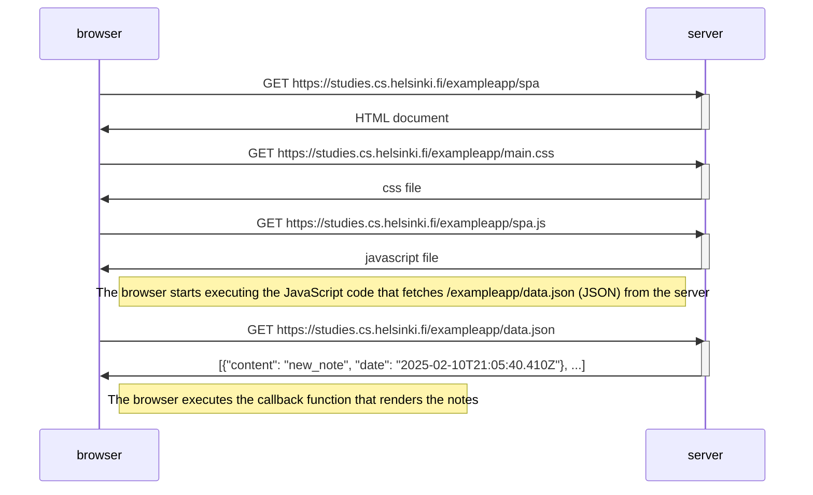

```mermaid
    sequenceDiagram
        participant browser
        participant server

        browser->>server: GET https://studies.cs.helsinki.fi/exampleapp/spa
        activate server
        server->>browser: HTML document
        deactivate server

        browser->>server: GET https://studies.cs.helsinki.fi/exampleapp/main.css
        activate server
        server->>browser: css file
        deactivate server

        browser->>server: GET https://studies.cs.helsinki.fi/exampleapp/spa.js
        activate server
        server->>browser: javascript file
        deactivate server

        Note right of browser: The browser starts executing the JavaScript code that fetches /exampleapp/data.json (JSON) from the server

        browser->>server: GET https://studies.cs.helsinki.fi/exampleapp/data.json
        activate server
        server->>browser: [{"content": "new_note", "date": "2025-02-10T21:05:40.410Z"}, ...]
        deactivate server

        Note right of browser: The browser executes the callback function that renders the notes

```