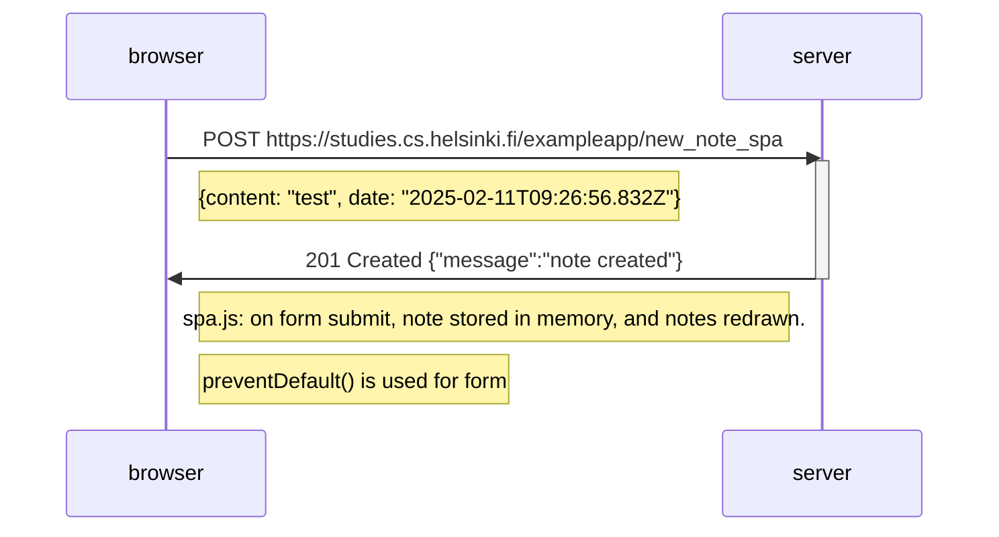

```mermaid
sequenceDiagram
    participant browser
    participant server

    browser->>server: POST https://studies.cs.helsinki.fi/exampleapp/new_note_spa
    activate server
    Note right of browser: {content: "test", date: "2025-02-11T09:26:56.832Z"}
    server->>browser: 201 Created {"message":"note created"}
    deactivate server

    Note right of browser: spa.js: on form submit, note stored in memory, and notes redrawn.

    Note right of browser: preventDefault() is used for form
```