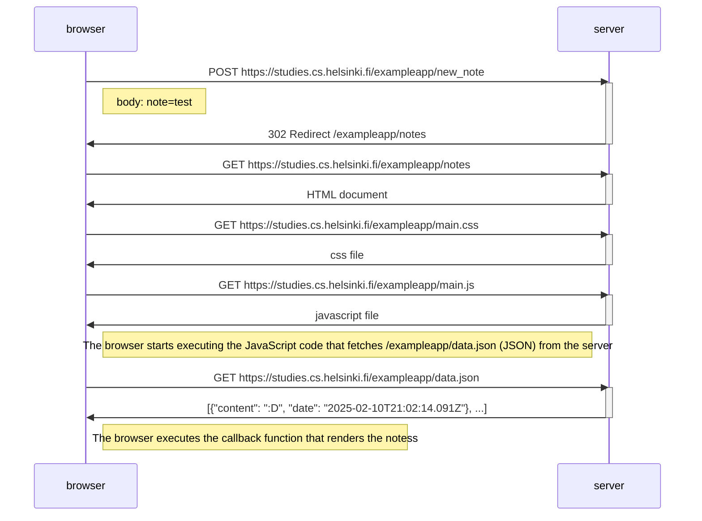

```mermaid
sequenceDiagram
    participant browser
    participant server

    browser->>server: POST https://studies.cs.helsinki.fi/exampleapp/new_note 
    activate server
    Note right of browser: body: note=test
    server->>browser: 302 Redirect /exampleapp/notes
    deactivate server

    browser->>server: GET https://studies.cs.helsinki.fi/exampleapp/notes
    activate server
    server->>browser: HTML document
    deactivate server

    browser->>server: GET https://studies.cs.helsinki.fi/exampleapp/main.css
    activate server
    server->>browser: css file
    deactivate server

    browser->>server: GET https://studies.cs.helsinki.fi/exampleapp/main.js
    activate server
    server->>browser: javascript file
    deactivate server

    Note right of browser: The browser starts executing the JavaScript code that fetches /exampleapp/data.json (JSON) from the server

    browser->>server: GET https://studies.cs.helsinki.fi/exampleapp/data.json
    activate server
    server->>browser: [{"content": ":D", "date": "2025-02-10T21:02:14.091Z"}, ...]
    deactivate server

    Note right of browser: The browser executes the callback function that renders the notess

```